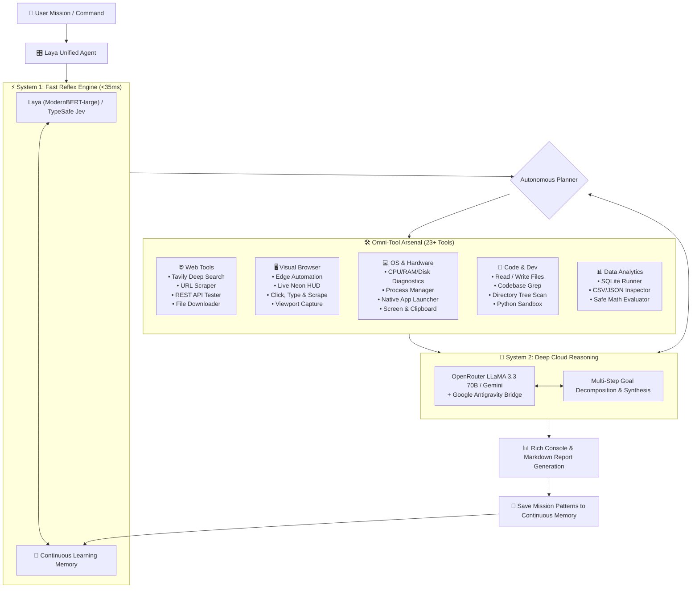

# ⚡ LAYA Omni-Agent: Dual-System Autonomous Operating Engine

[](https://www.python.org/downloads/)
[](#architecture)
[](#system-1-fast-reflex-routing)
[](#the-omni-tool-arsenal)
[](LICENSE)
[-teal.svg)](#hardware-efficiency--zero-local-llm-design)

> **LAYA Omni-Agent** is an ultra-fast, production-grade autonomous agent designed to run seamlessly on everyday hardware (even PCs with only 8GB RAM). Inspired by Daniel Kahneman’s *Thinking, Fast and Slow*, it combines **System 1 (sub-35ms local reflexive routing)** with **System 2 (cloud-assisted deep reasoning and multi-step decomposition)** to control web browsers, operating systems, codebases, and data pipelines in real time.

---

## 🌟 Key Highlights

- **⚡ Sub-35ms Reflexes**: Uses local **Laya** (`ModernBERT-large`, 421M params, ~400MB RAM) or **TypeSafe Jev** for instant intent classification and zero-hallucination tool routing.
- **🧠 System 2 Cloud Reasoning**: Orchestrates multi-step missions, deep research, and code generation via cloud APIs (LLaMA 3.3 70B via OpenRouter, Gemini, and Google Antigravity bridge) without freezing or bottlenecking local CPU/RAM.
- **🛠️ 23+ Real-World Tools**: Full native automation spanning live web search, visual Edge browser control, Windows OS diagnostics, code refactoring, and data analysis.
- **🖥️ Real-Time Visual HUD**: Launches Microsoft Edge in full-screen mode with an injected floating neon heads-up display so you can watch the agent browse, navigate, and scrape live.
- **📈 Self-Improving Memory**: Automatically caches successful query patterns, tool usage telemetry, and mission insights into persistent JSON memory across runs.
- **💻 Ultra-Lightweight**: Built specifically to eliminate the need for heavy 7B-70B local LLM weights (like Ollama or vLLM) that crash older 8GB machines.

---

## 🏗️ Architecture



---

## 🛠️ The Omni-Tool Arsenal

The agent comes pre-equipped with 23+ production tools divided into 5 specialized domains:

| Category | Tool | Description |
| :--- | :--- | :--- |
| **🌐 Live Web** | `web_search` | Real-time internet search via Tavily API with deep domain scraping and answer synthesis. |
| | `scrape_url` | HTTP extractor that fetches live web pages and converts them to clean markdown/text. |
| | `api_request` | Versatile REST client supporting GET, POST, headers, and JSON payloads. |
| | `download_file` | Streaming file downloader with progress tracking and custom destination paths. |
| **🖥️ Visual Browser** | `browser_search` | Launches Edge browser full-screen with real-time neon HUD showing active tasks. |
| | `browser_navigate` | Navigates directly to any web application or site with live status injection. |
| | `browser_click_element` | Clicks buttons, links, or inputs using CSS or XPath selectors. |
| | `browser_type_text` | Enters text into form fields, search boxes, and interactive inputs. |
| | `browser_extract_text` | Extracts live inner text from target DOM elements. |
| | `browser_screenshot` | Captures high-res screenshots of web pages saved to `screenshots/`. |
| **💻 Windows OS** | `hardware_diagnostics` | Real-time diagnostic scan of CPU cores, RAM usage, and disk volumes via `psutil`. |
| | `list_processes` | Enumerates active running processes sorted by memory consumption. |
| | `kill_process` | Gracefully or forcefully terminates misbehaving processes by PID. |
| | `launch_app` | Launches native Windows desktop applications (Notepad, Calculator, VSCode, etc.). |
| | `take_screenshot` | Captures full primary monitor screenshot using `Pillow ImageGrab`. |
| | `read_clipboard` | Reads current clipboard text into the agent context. |
| | `write_clipboard` | Copies generated results or code directly into the Windows clipboard. |
| | `run_powershell` | Safely executes PowerShell command lines and captures stdout/stderr. |
| **📂 Code & Dev** | `read_file` | Inspects local file contents with line limits and byte safeguards. |
| | `write_file` | Creates or updates project files safely. |
| | `search_codebase` | Recursively searches files for matching regex patterns or keywords. |
| | `directory_tree` | Generates a clean directory hierarchy tree with ignore filters. |
| | `run_python_sandbox` | Executes standalone Python code in an isolated subprocess with timeout protection. |
| | `git_status` | Inspects git working tree, modified files, and branch information. |
| **📊 Data Science** | `sql_query` | Executes arbitrary SQL queries against local SQLite database files. |
| | `inspect_dataset` | Analyzes CSV and JSON datasets (columns, shape, sample rows, null counts). |
| | `safe_eval_math` | Evaluates mathematical expressions using Python's AST without `eval()` vulnerabilities. |

---

## ⚡ System 1 vs. System 2 Breakdown

### System 1: Fast Reflex Routing (<35ms)
- **Local Engine**: Utilizes `laya` powered by `ModernBERT-large` (421M parameters).
- **Cloud Engine**: Supports `typesafe-sdk` (`Jev`) as a fallback or cloud-first classifier.
- **Latency**: 15ms - 35ms decision speed.
- **Role**: Immediate single-intent categorization, tool selection, parameter formatting, and fast response retrieval.
- **Resource Footprint**: Only ~400MB of RAM. Zero GPU required.

### System 2: Deep Reasoning & Synthesis
- **Engine**: Cloud API integration (`meta-llama/llama-3.3-70b-instruct` via OpenRouter or Gemini 1.5/2.0) and Antigravity Agent bridge.
- **Role**:
  1. Decomposing complex multi-phase missions (e.g., *"Find the top 3 AI papers this week, download their abstracts, summarize them into a markdown report, and copy the summary to my clipboard"*).
  2. Synthesizing messy raw tool outputs into actionable insights.
  3. Writing escalation tickets (`escalations/pending_task.json`) for complex coding interventions.

---

## 🧠 Continuous Learning Memory Engine

Every single mission executed is logged and indexed inside `memory/omni_memory.json`:
- **Pattern Learning**: Learns which tools succeed most often for particular user phrasings.
- **Execution Telemetry**: Tracks tool frequency, error rates, and average runtime.
- **Session Continuity**: Retains context across agent reboots without external vector database dependencies.

You can inspect memory stats at any time by typing `memory` in the agent CLI.

---

## 🚀 Quick Start

### 1. Prerequisites
- Windows 10 or 11 (64-bit)
- Python 3.10, 3.11, or 3.12
- Microsoft Edge or Google Chrome installed

### 2. Installation
```powershell
# Clone the repository
git clone https://github.com/yashrastogi069-dev/laya-omni-agent.git
cd laya-omni-agent

# Install dependencies
pip install -r requirements.txt

# Install Playwright browser drivers (Edge)
playwright install msedge
```

### 3. Configure API Keys
Set your keys as environment variables:
```powershell
# Required for live web search:
$env:TAVILY_API_KEY="tvly-your-key-here"

# Required for System 2 deep reasoning (OpenRouter):
$env:OPENROUTER_API_KEY="sk-or-v1-your-key-here"

# Optional:
$env:FIRECRAWL_API_KEY="your-firecrawl-key"
```

### 4. Run the Agent

**Option A — Double-Click Batch File:**
Simply double-click `START_LAYA_AGENT.bat` on your desktop or project folder.

**Option B — Interactive CLI:**
```powershell
python laya_agent.py
```

**Option C — One-Shot Command Execution:**
```powershell
python laya_agent.py "Check my CPU and RAM usage and tell me what is taking the most memory"
```

---

## 💬 Interactive CLI Commands

Inside the interactive prompt (`LayaAgent > `), you can use built-in commands:

- `tools` — View the complete 23+ tool catalog with descriptions.
- `memory` — View the agent's continuous learning telemetry and memory statistics.
- `engine laya` — Switch System 1 to local ModernBERT Laya engine.
- `engine jev` — Switch System 1 to TypeSafe Jev engine.
- `clear` — Clear the terminal and redraw the banner.
- `exit` or `quit` — Gracefully exit and persist memory.

---

## 🗺️ Future Roadmap & Development Plan

### 🔮 Phase 1: Core Foundation (Completed v2.5)
- [x] Dual-System cognitive architecture (System 1 Laya + System 2 OpenRouter/Antigravity).
- [x] 23+ Real-world tools across 5 domains (Web, Browser, OS, Dev, Data).
- [x] Visual Edge browser automation with floating neon HUD.
- [x] Persistent JSON memory engine with telemetry tracking.
- [x] Older hardware optimization (sub-400MB RAM, zero local heavy LLM).

### ⚡ Phase 2: Autonomous Engine Runtime (Checkpoints L0–L14.2 Completed)
- [x] **Sub-1ms Deterministic Policy Engine**: Hard OS invariants, protected paths/processes, multi-tiered autonomy, and zero-bypass Rule-0 defense (`omni_engine/policy/`).
- [x] **Provider Broker & Model Sovereignty**: Hierarchical two-level locking, RAM pressure debouncing, English-only scoping, and `USER_LOCKED` / `USER_PREFERRED` sovereignty (`omni_engine/providers/`).
- [x] **Deep Research Engine**: SHA-256 cryptographic citation ledger, bounded crawl saturation, and untrusted prompt injection sanitization (`omni_engine/research/`).
- [x] **Real Browser Engine**: Persistent isolated Playwright sessions, dynamic `@1..@N` element indexing, and DOM mutation receipts (`omni_engine/browser/`).
- [x] **Windows Desktop & Service Engine**: Trampoline PID resolution, visible window diffing, and dual-stack loopback socket health probers (`omni_engine/desktop/`).
- [x] **n8n Automation Engine**: Draft-Test-Validate Gate Triad, acyclic DAG connection validator, and zero-plaintext secret scrubbing (`omni_engine/automation/`).
- [x] **Foreman Supervised Developer Engine**: 5-stage convergence loop, AST pre-test syntax gate, and byte-for-byte dirty worktree preservation (`omni_engine/developer/`).
- [x] **Persisted SQLite Quest Runtime**: Strict deterministic state machine, Optimistic Concurrency Control (OCC), and transaction atomicity (`omni_engine/quest/`).
- [x] **Exactly-Once Operation Ledger**: Multi-attempt tracking, attempt-level database CAS concurrency, and `UNKNOWN_COMMIT` reconciliation history (`omni_engine/operations/`).
- [x] **Deterministic DAG Planner & 10-Pass Validator**: Cryptographic plan hashing, complete provenance metadata, and multi-pass structural validation firewall (`omni_engine/planning/`).
- [x] **Deterministic DAG Executor**: Parallel read-only worker pools, serialized mutation barriers, non-blocking step timeouts, and active cancellation with durable intent (`omni_engine/execution/`).

### 🚀 Phase 3: Autonomous Swarm & Vision (Upcoming v3.0)
- [ ] **Vision-Language Grounding**: Integrate OmniParser / lightweight YOLO to click on arbitrary web/desktop UI elements without needing DOM selectors.
- [ ] **Multi-Agent Collaboration**: Support specialized sub-agent handoffs (Researcher Agent, Coder Agent, QA Verifier) communicating asynchronously.
- [ ] **Voice I/O Interface**: Add fast local Whisper speech-to-text and Piper text-to-speech for hands-free voice control.
- [ ] **Desktop GUI Automation**: Extend beyond web into full desktop mouse/keyboard automation via Windows UI Automation API.

### 🌐 Phase 4: Ecosystem & Integrations (v3.5)
- [ ] **Workflow Integrations**: Native N8N and Zapier webhook triggers to run Laya agents from Discord/Slack/Telegram.
- [ ] **Vector Episodic Memory**: Hybrid memory with ChromaDB / FAISS for semantic document search over historical missions.
- [ ] **Multi-Tab Browser Workflows**: Simultaneous parallel tab navigation and cross-site comparison.

### 🧬 Phase 5: Self-Training Pipeline (v4.0)
- [ ] **Automated DPO/SFT Dataset Generator**: Every successful multi-step mission automatically formats into instruction tuning pairs.
- [ ] **Continuous LoRA Fine-Tuning**: Periodically retrain the local ModernBERT weights on local machine logs to make System 1 smarter over time.

---

## 🤝 Contributing

Contributions, issues, and feature requests are welcome!
Feel free to check [issues page](https://github.com/yashrastogi069-dev/laya-omni-agent/issues).

1. Fork the Project
2. Create your Feature Branch (`git checkout -b feature/AmazingFeature`)
3. Commit your Changes (`git commit -m 'Add some AmazingFeature'`)
4. Push to the Branch (`git push origin feature/AmazingFeature`)
5. Open a Pull Request

---

## 📄 License

Distributed under the MIT License. See `LICENSE` for more information.

---

<p align="center">
  <b>Built with ❤️ by Yash Rastogi & the Open Source AI Community</b>
</p>
