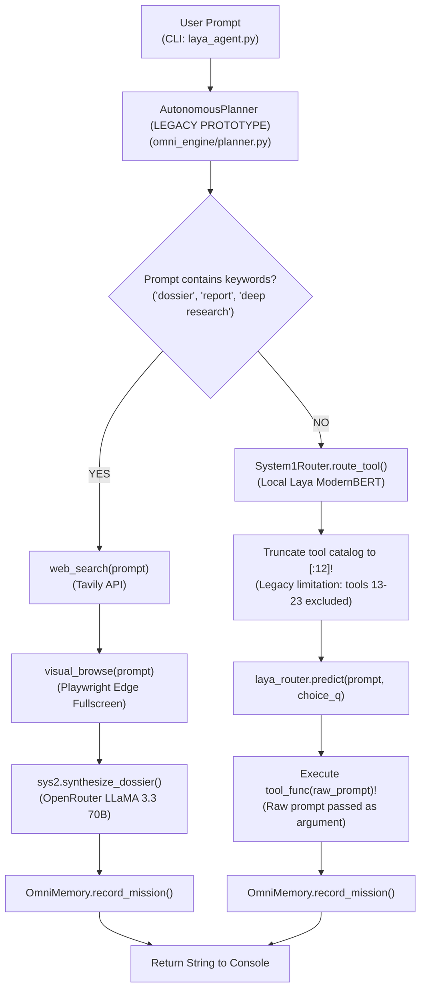

# ARCHITECTURE.md — System Architecture: Current vs. Target

---

# SECTION 1: CURRENT EXECUTABLE ARCHITECTURE (v2.5 Prototype)

### Current Prototype Characteristics:
1. **Shallow Classification**: `System1Router` acts as a single-question tool classifier evaluating only 12 tools due to a legacy array slice.
2. **Hardcoded Workflows**: Multi-step execution is limited to a single hard-coded research path triggered by string matching keywords like `"dossier"` and `"report"`.
3. **No Argument Extraction**: The raw user prompt is passed directly into Python functions (`tool_func(mission_prompt)`).
4. **Standalone Prototype**: All runtime coordination exists in local script files rather than a validated DAG planner-executor.

---

# SECTION 2: TARGET ARCHITECTURE (LAYA Complete Standalone Autonomous Agent)

```mermaid
flowchart TD
    UserEvent["👤 User Request / Event Trigger"] --> Boundary["Clean Interface Boundary\n(AgentRequest / AgentResponse)"]
    
    subgraph S1["⚡ SYSTEM 1: FAST DECISION FABRIC (<35ms)"]
        Boundary --> S1Engine["SystemOneProvider\n(Local Laya ModernBERT / Optional Jev)"]
        S1Engine --> DecFrame["Typed DecisionFrame\n• Intent & Task Class\n• Urgency, Importance, Risk & Ambiguity\n• Needs Clarification? Needs Plan? Needs Tools?"]
        
        subgraph Hierarchical["🧭 Hierarchical Capability Router (L6)"]
            DecFrame --> DomainRoute["1. Domain Classification\n(web, browser, os, dev, data)"]
            DomainRoute --> SkillRoute["2. Skill Selection\n(Known workflow template)"]
            SkillRoute --> CapRoute["3. Small Bounded Candidate Set\n(Fail-open fallback)"]
        end
    end
    
    DecFrame --> ClarifyCheck{"Needs Clarification?"}
    ClarifyCheck -- YES --> ClarifyUser["Solicit User Input / Clarify Ambiguity"]
    
    ClarifyCheck -- NO --> ModeCheck{"Known Skill / Single Step\nor Novel Multi-Step?"}
    
    %% Fast Skill Execution Path
    ModeCheck -- Skill Template --> SkillExec["Execute Skill Template / Direct Tool"]
    
    %% Novel Multi-Step Planning Path
    subgraph Planning["🗺️ STRUCTURED DAG PLANNER & VALIDATOR (L12-L13)"]
        ModeCheck -- Novel Plan Required --> DAGPlanner["Structured DAG Planner\n(OpenRouter / Generative Tier)"]
        DAGPlanner --> PlanVal["Plan Validator\n(Acyclic check, schema match, budget & permission check)"]
    end
    
    %% Persistent Quest Engine
    subgraph QuestRuntime["🛡️ PERSISTED QUEST RUNTIME (L10)"]
        PlanVal --> QuestCreate["Persist Quest & QuestSteps\n(SQLite Engine: Survives Restarts)"]
        SkillExec --> QuestCreate
        
        QuestCreate --> DAGExec["Deterministic DAG Executor (L14)\n(Topological Step Traversal)"]
        DAGExec --> ArgResolver["Typed Argument Resolver (L8)\n(Regex/AST → State Extraction → Structured Model)"]
        
        ArgResolver --> PolicyGate{"Deterministic Action Policy (L9)\n(ActionClass & Autonomy Profile Gate)"}
        PolicyGate -- Restricted --> UserConfirm["User Confirmation Gate"]
        UserConfirm -- Approved --> Ledger["Operation Ledger (L11)\n(Logical Idempotency: questId:stepId:capabilityId)"]
        PolicyGate -- Permitted --> Ledger
        
        Ledger --> DispatchTool["Capability Dispatch\n(Canonical CapabilitySpec & ToolResult Envelope)"]
    end
    
    %% Verification & Telemetry
    subgraph Verify["🔍 EVIDENCE-BASED COMPLETION ENGINE (L15)"]
        DispatchTool --> DetVerif["Deterministic Verifier\n(File diff, process state, DOM receipt, exit code)"]
        DetVerif --> SemVerif{"Semantic Check Needed?"}
        SemVerif -- YES --> LayaSemCheck["Cheap Laya Semantic Validation"]
        SemVerif -- NO --> StepComplete["Mark Step COMPLETED\n(Record ExecutionReceipt)"]
        LayaSemCheck --> StepComplete
    end
    
    StepComplete --> DependCheck{"More Ready Steps?"}
    DependCheck -- YES --> DAGExec
    DependCheck -- NO --> QuestFinal["Finalize Quest\n(All required steps COMPLETED or BLOCKED)"]
    
    QuestFinal --> MemEngine["Memory Engine (L19)\n(Working, Episodic, Semantic, Procedural Experience)"]
    MemEngine --> FinalResponse["Return Structured AgentResponse"]
```

### Standalone Architectural Invariants:
1. **Fully Autonomous & Standalone**: LAYA possesses its own complete Quest runtime, DAG executor, capability contracts, action policy, and memory engine.
2. **System 1 Nervous System**: LAYA drives bounded, high-frequency decisions (<35ms) while deterministic code owns execution, state transitions, and safety.
3. **Hierarchical Routing**: Solves tool scalability via `Request → Domain → Skill → Candidate Set → Capability`, eliminating naive flat catalog dumps.
4. **Evidence-Based Truth**: No action is reported completed without physical verification (file existence, process table check, DOM state).
5. **Clean Interface Contracts**: Boundaries use clean schemas (`AgentRequest`, `AgentResponse`, `DecisionFrame`, `Quest`, `CapabilitySpec`, `ToolResult`, `ExecutionReceipt`, `VerificationResult`, `AgentEvent`) ensuring future multi-agent interoperability.

---

# SECTION 3: REAL CAPABILITY ENGINES SUBSTRATE (R1 – R5)

The capability layer provides five verified real-world execution substrates executing underneath the typed contracts:

1. **Phase R1: Deep Evidence-Grounded Research Engine (`omni_engine/research/`)**:
   - Multi-source crawl, dynamic page extraction with Scrapling/BS4 fallback, and NFKC unicode/control char sanitization.
   - Mathematical saturation stopping condition ($Y_k \le 0.15$ for 2 rounds) and cryptographic citation verification (`ev_<hash[:10]>`) quarantining unverified claims.
2. **Phase R2: Real Browser Engine (`omni_engine/browser/`)**:
   - Persistent isolated Chromium context (`~/.laya/browser_profile`), stale singleton lock recovery, and single-page invariant (`max_pages=1`).
   - Dynamic indexed action space (`@1..@N`) with semantic fingerprinting and pre-execution staleness validation.
   - Evidence-based post-action verification receipts (`dom_mutated`, `input_value`, `url_changed`) and hard financial confirmation gating.
3. **Phase R3: Windows Desktop, App & Local Service Engine (`omni_engine/desktop/`)**:
   - Safe Win32 activation (menu-key foreground claim, `IsHungAppWindow` pre-check, non-blocking `ShowWindowAsync`).
   - Process trampoline resolution via HWND baseline diffing and `psutil` child-tree traversal.
   - Dual-stack loopback service health prober (`SO_LINGER`, isolated proxy bypass).
   - Inviolable Rule-0 OS process termination protection (`csrss`, `lsass`, PID 0/4).
4. **Phase R4: Programmatic n8n Automation Engine (`omni_engine/automation/`)**:
   - Programmatic n8n v1 REST integration enforcing draft mode (`active=False`) on creation.
   - Strict Draft-Test-Validate Gate Triad: DAG validation (3-color topological DFS), physical test run receipt for current deterministic `workflow_hash`, and multi-pattern SecretScrubber.
   - Wait node polling breakout preventing thread stall, two-tier RCE and Stage 0 command policy defense.
5. **Phase R5: Supervised Developer Agent & Antigravity Substrate (`omni_engine/developer/`)**:
   - Foreman 5-stage bounded supervision lifecycle (Setup -> Mutation -> AST Syntax Gate -> Test -> Convergence/Revert).
   - Deterministic thrashing & oscillation cycle detection via composite SHA-256 state fingerprinting.
   - Subprocess process-tree isolation on Windows (`CREATE_NEW_PROCESS_GROUP`, `taskkill /F /T /PID`, 50k char output truncation).
   - Git workspace confinement validating `.git` and blocking path traversal (`is_relative_to` & `commonpath`).
   - Inviolable safe reversion primitive (never `git reset --hard` or `git clean -fd`) and anti-tampering on test suites (`allow_test_edits=False`).

---

# SECTION 4: PERSISTED RUNTIME & DURABILITY GATES (L10 – L14.2)

The execution runtime implements a multi-tier, crash-resilient control plane:

1. **SQLite Quest State Machine (`omni_engine/quest/`)**:
   - Persists `quests`, `quest_steps`, and `quest_events` with WAL mode, `PRAGMA synchronous = NORMAL`, and Optimistic Concurrency Control (`version` column).
   - Invariant 6 lifecycle: `CREATED -> PLANNED -> RUNNING -> PAUSED -> AWAITING_VERIFICATION -> COMPLETED / FAILED / CANCELLED`. Cannot jump directly from `RUNNING` to `COMPLETED`.
2. **Operation Ledger & Exactly-Once Idempotency (`omni_engine/operations/`)**:
   - 4-component auto-derived idempotency key: `idem_{quest_id}_{step_id}_{capability_id}_{arg_hash[:16]}` prevents cross-step collisions within the same quest while caller custom keys bridge quests.
   - Database-level conditional CAS lease updates: `UPDATE operations SET state = 'in_progress', current_attempt = current_attempt + 1 ... WHERE state IN ('pending', 'failed') AND current_attempt = ? AND current_attempt < max_attempts`, backed by `UNIQUE(operation_id, attempt_number)` schema constraint.
   - Mutation uncertainty defense: post-dispatch timeouts quarantine into `UNKNOWN_COMMIT` and quest pauses in `PAUSED_FOR_RECONCILIATION`.
   - Append-only audit history in `operation_reconciliations` table.
3. **Structured DAG Planner & Plan Validator Firewall (`omni_engine/planning/`)**:
   - Template-first precedence (<1ms) with generative JSON fallback.
   - 10-pass deterministic validation firewall: acyclicity, dependencies, capabilities, schema, policy feasibility, autonomy compliance, step bounds, graph depth, mutation safety with transitive ancestor conflict detection, and resource budgets.
   - Rejects unsupported decorative fields (`can_fail_silently=True`) at the validation gate.
4. **Deterministic DAG Executor (`omni_engine/execution/`)**:
   - Single-thread Kahn coordinator loop eliminating SQLite OCC collisions.
   - Concurrency control: concurrent `READ_ONLY` worker threads (`ThreadPoolExecutor`) + exclusive `_mutation_lock` barrier draining read workers before dispatching mutations.
   - Plan Tamper Firewall: Canonical SHA-256 `Plan.compute_hash()` recomputed prior to execution; halts with `ExecutionFirewallError` if SQLite plan steps were tampered with.
   - Active cancellation via `_cancellation_events` cleanly draining workers without lease collisions.
5. **Transactional Fault Injection Verification (D1–D6)**:
   - Real SQLite mid-transaction fault injection proofs covering `begin_attempt` (D1), `commit_attempt` (D2), `fail_attempt` (D3), `transition_quest` (D4), `transition_step` (D5), and `attach_plan` (D6), verifying complete transaction rollback and internal consistency across cold database restarts.

