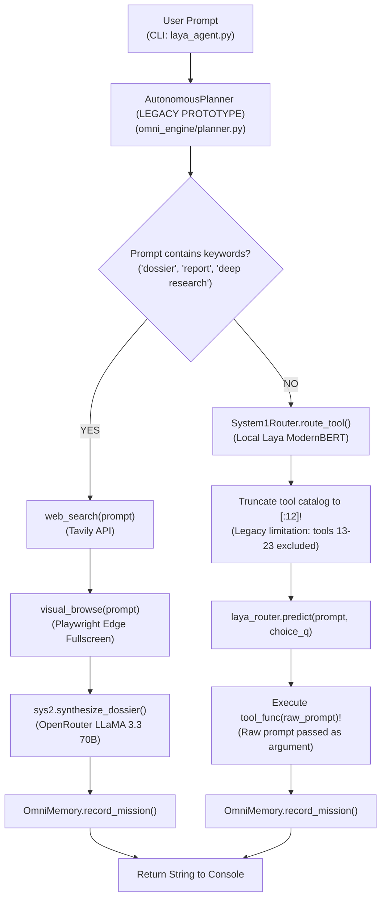

# ARCHITECTURE.md — System Architecture: Current vs. Target

---

# SECTION 1: CURRENT EXECUTABLE ARCHITECTURE (v2.5 Prototype)

### Current Prototype Characteristics:
1. **Shallow Classification**: `System1Router` acts as a single-question tool classifier evaluating only 12 tools due to a legacy array slice.
2. **Hardcoded Workflows**: Multi-step execution is limited to a single hard-coded research path triggered by string matching keywords like `"dossier"` and `"report"`.
3. **No Argument Extraction**: The raw user prompt is passed directly into Python functions (`tool_func(mission_prompt)`).
4. **Standalone Prototype**: All runtime coordination exists in local script files rather than a validated DAG planner-executor.

---

# SECTION 2: TARGET ARCHITECTURE (LAYA Complete Standalone Autonomous Agent)

```mermaid
flowchart TD
    UserEvent["👤 User Request / Event Trigger"] --> Boundary["Clean Interface Boundary\n(AgentRequest / AgentResponse)"]
    
    subgraph S1["⚡ SYSTEM 1: FAST DECISION FABRIC (<35ms)"]
        Boundary --> S1Engine["SystemOneProvider\n(Local Laya ModernBERT / Optional Jev)"]
        S1Engine --> DecFrame["Typed DecisionFrame\n• Intent & Task Class\n• Urgency, Importance, Risk & Ambiguity\n• Needs Clarification? Needs Plan? Needs Tools?"]
        
        subgraph Hierarchical["🧭 Hierarchical Capability Router (L6)"]
            DecFrame --> DomainRoute["1. Domain Classification\n(web, browser, os, dev, data)"]
            DomainRoute --> SkillRoute["2. Skill Selection\n(Known workflow template)"]
            SkillRoute --> CapRoute["3. Small Bounded Candidate Set\n(Fail-open fallback)"]
        end
    end
    
    DecFrame --> ClarifyCheck{"Needs Clarification?"}
    ClarifyCheck -- YES --> ClarifyUser["Solicit User Input / Clarify Ambiguity"]
    
    ClarifyCheck -- NO --> ModeCheck{"Known Skill / Single Step\nor Novel Multi-Step?"}
    
    %% Fast Skill Execution Path
    ModeCheck -- Skill Template --> SkillExec["Execute Skill Template / Direct Tool"]
    
    %% Novel Multi-Step Planning Path
    subgraph Planning["🗺️ STRUCTURED DAG PLANNER & VALIDATOR (L12-L13)"]
        ModeCheck -- Novel Plan Required --> DAGPlanner["Structured DAG Planner\n(OpenRouter / Generative Tier)"]
        DAGPlanner --> PlanVal["Plan Validator\n(Acyclic check, schema match, budget & permission check)"]
    end
    
    %% Persistent Quest Engine
    subgraph QuestRuntime["🛡️ PERSISTED QUEST RUNTIME (L10)"]
        PlanVal --> QuestCreate["Persist Quest & QuestSteps\n(SQLite Engine: Survives Restarts)"]
        SkillExec --> QuestCreate
        
        QuestCreate --> DAGExec["Deterministic DAG Executor (L14)\n(Topological Step Traversal)"]
        DAGExec --> ArgResolver["Typed Argument Resolver (L8)\n(Regex/AST → State Extraction → Structured Model)"]
        
        ArgResolver --> PolicyGate{"Deterministic Action Policy (L9)\n(ActionClass & Autonomy Profile Gate)"}
        PolicyGate -- Restricted --> UserConfirm["User Confirmation Gate"]
        UserConfirm -- Approved --> Ledger["Operation Ledger (L11)\n(Logical Idempotency: questId:stepId:capabilityId)"]
        PolicyGate -- Permitted --> Ledger
        
        Ledger --> DispatchTool["Capability Dispatch\n(Canonical CapabilitySpec & ToolResult Envelope)"]
    end
    
    %% Verification & Telemetry
    subgraph Verify["🔍 EVIDENCE-BASED COMPLETION ENGINE (L15)"]
        DispatchTool --> DetVerif["Deterministic Verifier\n(File diff, process state, DOM receipt, exit code)"]
        DetVerif --> SemVerif{"Semantic Check Needed?"}
        SemVerif -- YES --> LayaSemCheck["Cheap Laya Semantic Validation"]
        SemVerif -- NO --> StepComplete["Mark Step COMPLETED\n(Record ExecutionReceipt)"]
        LayaSemCheck --> StepComplete
    end
    
    StepComplete --> DependCheck{"More Ready Steps?"}
    DependCheck -- YES --> DAGExec
    DependCheck -- NO --> QuestFinal["Finalize Quest\n(All required steps COMPLETED or BLOCKED)"]
    
    QuestFinal --> MemEngine["Memory Engine (L19)\n(Working, Episodic, Semantic, Procedural Experience)"]
    MemEngine --> FinalResponse["Return Structured AgentResponse"]
```

### Standalone Architectural Invariants:
1. **Fully Autonomous & Standalone**: LAYA possesses its own complete Quest runtime, DAG executor, capability contracts, action policy, and memory engine.
2. **System 1 Nervous System**: LAYA drives bounded, high-frequency decisions (<35ms) while deterministic code owns execution, state transitions, and safety.
3. **Hierarchical Routing**: Solves tool scalability via `Request → Domain → Skill → Candidate Set → Capability`, eliminating naive flat catalog dumps.
4. **Evidence-Based Truth**: No action is reported completed without physical verification (file existence, process table check, DOM state).
5. **Clean Interface Contracts**: Boundaries use clean schemas (`AgentRequest`, `AgentResponse`, `DecisionFrame`, `Quest`, `CapabilitySpec`, `ToolResult`, `ExecutionReceipt`, `VerificationResult`, `AgentEvent`) ensuring future multi-agent interoperability.
