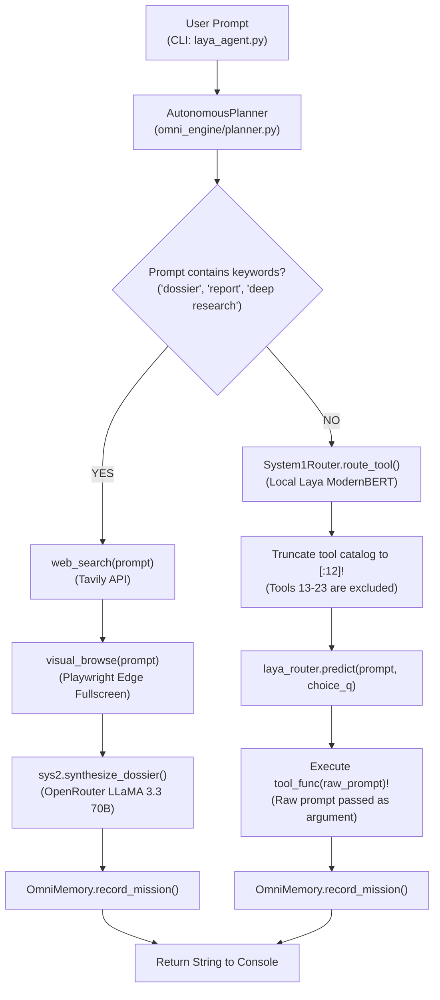

# ARCHITECTURE.md — System Architecture: Current vs. Target

---

# SECTION 1: CURRENT EXECUTABLE ARCHITECTURE (v2.5 Prototype)

### Current Architecture Characteristics:
1. **Shallow Classification**: `System1Router` acts as a single-question tool classifier, evaluating only 12 tools due to a hardcoded array slice.
2. **Hardcoded Workflows**: Multi-step execution is limited to a single hard-coded research path triggered by string matching against keywords like `"dossier"` and `"report"`.
3. **No Argument Extraction**: The raw user prompt is passed directly into Python functions (`tool_func(mission_prompt)`).
4. **No Plan Validation or Graph Execution**: There is no dependency graph, no topological sort, and no state machine.
5. **No Evidence Verification**: Actions are assumed successful if the function does not crash.
6. **Flat Unverified Memory**: `OmniMemory` stores raw strings and increments execution counts without evaluating actual task success.

---

# SECTION 2: TARGET PRODUCTION ARCHITECTURE (Future L2 – L25)

```mermaid
flowchart TD
    User["👤 User Objective / Event Trigger"] --> Norm["1. Normalizer & Trace Initializer\n(traceId, turnId)"]
    
    subgraph S1["⚡ System 1: Fast Decision Fabric (<35ms)"]
        Norm --> S1Engine["SystemOneProvider\n(Local Laya ModernBERT / Jev Fallback)"]
        S1Engine --> DecFrame["2. Typed DecisionFrame\n• Intent & Task Class\n• Urgency & Importance\n• Risk & Ambiguity\n• Needs Plan? Needs Clarification?"]
    end
    
    DecFrame --> ClarifyCheck{"Needs Clarification\nor Ambiguous?"}
    ClarifyCheck -- YES --> ClarifyUser["Ask User Clarification / Await Input"]
    
    ClarifyCheck -- NO --> RouteCheck{"Single Step\nor Multi-Step?"}
    
    %% Hierarchical Routing
    subgraph Routing["🧭 Hierarchical Capability Router"]
        RouteCheck -- Single Step --> DomainRoute["Domain Selection\n(Web, OS, Dev, Browser, Data)"]
        DomainRoute --> SkillOrCap["Skill Match or Capability Pruning\n(Fail-open Shadow Mode)"]
    end
    
    SkillOrCap --> ArgResolve["3. Typed Argument Resolver\n(Regex/AST → Conversation State → Small Structured Model)"]
    
    %% Multi-Step Planning
    subgraph Planning["🗺️ Structured DAG Planner & Validator"]
        RouteCheck -- Multi-Step --> DAGPlanner["Structured DAG Planner\n(OpenRouter / Antigravity System 2)"]
        DAGPlanner --> PlanVal["Plan Validator\n(Acyclic check, schema match, budget & permission check)"]
    end
    
    PlanVal --> QuestCreate["4. Quest Engine (SQLite)\n(Persist Quest, Steps & Dependencies)"]
    ArgResolve --> QuestCreate
    
    %% Deterministic Execution
    subgraph Execution["⚙️ Deterministic DAG Executor & Policy"]
        QuestCreate --> DAGExec["DAG Executor\n(Topological Step Traversal)"]
        DAGExec --> PolicyCheck{"Policy & Autonomy Gate\n(ActionClass Check)"}
        PolicyCheck -- Requires Confirmation --> ConfirmGate["User Confirmation Prompt"]
        ConfirmGate -- Approved --> Ledger["Operation Ledger\n(Idempotency: questId:stepId:capabilityId)"]
        PolicyCheck -- Auto-Permitted --> Ledger
        
        Ledger --> DispatchTool["Canonical Capability Dispatch\n(CapabilitySpec Contract)"]
    end
    
    %% Verification & Completion
    subgraph Verify["🔍 Evidence-Based Verifier"]
        DispatchTool --> DetVerif["Deterministic Verifier\n(File existence, exit code, process state, DOM receipt)"]
        DetVerif --> SemVerif{"Semantic Check Needed?"}
        SemVerif -- YES --> LayaSemCheck["Cheap Laya Semantic Validation"]
        SemVerif -- NO --> StepComplete["Mark Step COMPLETED"]
        LayaSemCheck --> StepComplete
    end
    
    StepComplete --> DependCheck{"More Ready Steps?"}
    DependCheck -- YES --> DAGExec
    DependCheck -- NO --> QuestDone["5. Quest Finalization\n(All steps verified COMPLETED or BLOCKED)"]
    
    QuestDone --> MemV2["6. Memory V2 (Working, Episodic, Semantic, Procedural)\n(Record verified receipts & outcome telemetry)"]
    MemV2 --> FinalResp["Produce Accurate Truth-Based Response"]
```

### Key Target Architectural Invariants:
1. **DecisionFrame**: System 1 evaluates multi-dimensional signals in parallel (urgency, importance, risk, ambiguity, planning requirements).
2. **Hierarchical Routing**: Capabilities scale to hundreds without bloating prompt context; candidate capabilities are selected through Domain → Skill → Tool filtering.
3. **Structured Argument Resolver**: Arguments are deterministically parsed or extracted via schema-guided models before invoking capabilities.
4. **Persisted Quest Engine**: All tasks run as Quests stored in SQLite, surviving restarts, timeouts, and replans.
5. **Operation Ledger**: Logical mutation identity prevents duplicate side effects and ensures exactly-once semantics.
6. **Deterministic DAG Executor**: Steps run with strict dependency management, concurrency on read-only steps, and serialized mutations.
7. **Evidence-Based Verifier**: Real physical receipts (file diffs, process tables, DOM state, SQL rows) are inspected before any action is marked completed.
