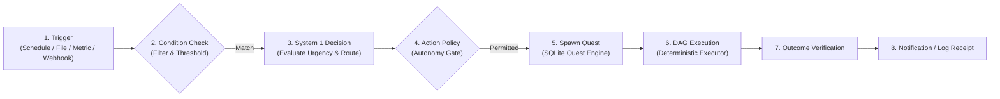

# AUTOMATION_MODEL.md — Persistent & Event-Driven Automation

## 1. Vision & Core Principles
In the LAYA Omni Agent, automation is NOT an infinite polling while-loop.
Automation is a **first-class, event-driven subsystem** that evaluates conditions and spawns persisted Quests under strict policy governance.



---

## 2. Trigger Types

1. **Schedule**: Cron expressions or recurring intervals (e.g., `every 1h`, `daily at 09:00`).
2. **Filesystem**: File creation, modification, or deletion within watched workspace folders.
3. **System Metrics**: Threshold events evaluated via `psutil` (e.g., `RAM > 85% for 5 min`, `Disk < 10GB free`).
4. **Git Events**: Branch updates, commit arrivals, or uncommitted diff detection.
5. **Webhooks / Inbound Events**: Local HTTP webhook triggers.

---

## 3. Persistent Schema (`automations` table in SQLite)

```sql
CREATE TABLE IF NOT EXISTS automations (
    automation_id TEXT PRIMARY KEY,
    name TEXT NOT NULL,
    trigger_type TEXT NOT NULL,          -- 'schedule', 'file', 'metric', 'webhook'
    trigger_config TEXT NOT NULL,        -- JSON: cron expression, file path, metric threshold
    condition_expr TEXT,                -- Python / AST boolean condition
    target_skill_or_prompt TEXT NOT NULL,
    autonomy_profile TEXT NOT NULL,      -- 'ADVISOR', 'LOCAL_OPERATOR', etc.
    cooldown_seconds INTEGER DEFAULT 300,
    last_triggered_at INTEGER,
    next_run_at INTEGER,
    status TEXT DEFAULT 'ACTIVE',       -- 'ACTIVE', 'PAUSED', 'DISABLED'
    created_at INTEGER NOT NULL,
    updated_at INTEGER NOT NULL
);
```

---

## 4. Automation Safety & Deduplication Invariants

1. **Cooldown Enforcement**: An automation cannot trigger faster than its configured cooldown interval, preventing runaway loops.
2. **Deduplication Key**: Each trigger event produces an idempotency hash; duplicate events within the active window are dropped.
3. **No External Writes Without Explicit Authorization**: Automated background Quests default to `READ_ONLY` or `LOCAL_CREATE` within sandboxed directories. High-risk actions (`EXTERNAL_SEND`, `LOCAL_DELETE`) require explicit persistent token authorization.
