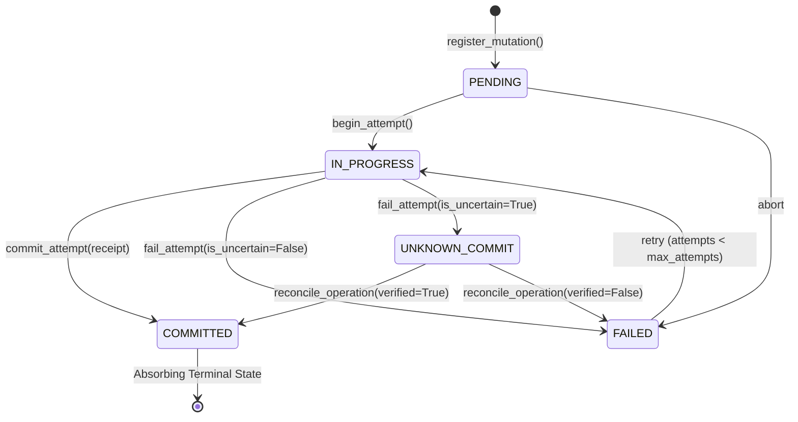

# ADR-014: Operation Ledger & Exactly-Once Mutation Semantics

- **Status**: ACCEPTED & IMPLEMENTED
- **Date**: 2026-09-25
- **Author**: Antigravity / LAYA Autonomous Core Team
- **Milestone**: Checkpoint L11 (LAYA Autonomous V2)
- **Supersedes**: N/A
- **Related ADRs**:
  - `docs/research/ADR_L10_QUEST_RUNTIME.md` (ADR-013: Persisted SQLite Quest Runtime)
  - `docs/research/ADR_R5_DEVELOPER_AGENT.md` (Foreman Supervision & Confinement)
  - `docs/research/ADR_R4_N8N_AUTOMATION_ENGINE.md` (n8n Gate Triad)
  - `docs/research/ADR_R3_WINDOWS_APP_ENGINE.md` (Windows Trampoline Resolution & Receipts)

---

## 1. Context & Problem Statement

Autonomous agents that interact with real systems (filesystems, REST APIs, desktop UI, payment gateways, shell processes) face inherent network partitions, unexpected process crashes, timeouts, and execution retries.

Without an Operation Ledger:
1. **Blind Retries Cause Duplicate Side Effects**: A timeout waiting for an HTTP response from an n8n webhook or payment gateway may prompt a naive agent to re-execute the step, resulting in double-charging or duplicated file mutations.
2. **Loss of Mutation Identity**: When execution is distributed across DAG steps, sub-processes, or restarts, the system cannot verify whether a mutation was already executed.
3. **No Defense Against Unknown Commit States**: If an operation times out during execution, its physical outcome is indeterminate. Naive retry is dangerous; assuming success is equally dangerous.

---

## 2. Prime Directive & Core Invariants

1. **Deterministic Control (Invariant 1)**:
   - Mutation states, external idempotency keys, execution attempts, and attempt bounding are strictly governed by deterministic runtime code (`OperationLedger` and `OperationStore`).
   - Generative models must never decide whether a mutation has already executed or whether to blindly retry an uncertain state.

2. **Exactly-Once Mutation Semantics**:
   - Re-registering or invoking a mutation whose idempotency key matches an already `COMMITTED` operation record immediately returns the cached physical execution receipt without re-executing (`is_deduplicated=True`).

3. **Strict UNKNOWN_COMMIT Defense (Invariant 6 - Evidence-Based Completion)**:
   - When an attempt encounters a timeout, network disconnect, or crash where the real-world effect is unconfirmed, the operation transitions to `UNKNOWN_COMMIT`.
   - Blind retries on `UNKNOWN_COMMIT` operations are strictly forbidden (`OperationCommitUncertainError`).
   - Resolution requires physical evidence reconciliation (`reconcile_operation`) via external status probing, DOM inspection, file hashing, or database queries.

4. **Bounded Execution Attempts**:
   - Every mutation has an explicit `max_attempts` budget (default: 3). Once exhausted, retries are blocked with `MaxAttemptsExceededError`.

---

## 3. Architecture & Data Contracts

### 3.1 State Machine Matrix



### 3.2 Canonical Argument Hashing & Idempotency Keying

Idempotency keys are deterministically generated from the capability identifier and key-sorted argument JSON:

```python
canonical_str = json.dumps(arguments, sort_keys=True, default=str)
argument_hash = hashlib.sha256(canonical_str.encode("utf-8")).hexdigest()
idempotency_key = f"idem_{capability_id}_{argument_hash[:16]}"
```

Key order differences produce identical hashes, while value differences produce distinct hashes.

### 3.3 Relational SQLite Schema

```sql
CREATE TABLE IF NOT EXISTS operations (
    operation_id TEXT PRIMARY KEY,
    quest_id TEXT NOT NULL,
    step_id TEXT NOT NULL,
    capability_id TEXT NOT NULL,
    idempotency_key TEXT NOT NULL UNIQUE,
    argument_hash TEXT NOT NULL,
    state TEXT NOT NULL,
    current_attempt INTEGER NOT NULL DEFAULT 0,
    max_attempts INTEGER NOT NULL DEFAULT 3,
    execution_receipt TEXT,
    error TEXT,
    created_at REAL NOT NULL,
    updated_at REAL NOT NULL
);

CREATE TABLE IF NOT EXISTS operation_attempts (
    attempt_id TEXT PRIMARY KEY,
    operation_id TEXT NOT NULL,
    attempt_number INTEGER NOT NULL,
    state TEXT NOT NULL,
    started_at REAL NOT NULL,
    finished_at REAL,
    execution_receipt TEXT,
    error TEXT,
    FOREIGN KEY (operation_id) REFERENCES operations(operation_id) ON DELETE CASCADE
);
```

### 3.4 Concurrency & Python 3.12 PEP 249 Hygiene

In Python 3.12, `sqlite3.connect(..., autocommit=False)` enters PEP 249 mode where `execute("SELECT ...")` implicitly opens a deferred read transaction. If left open across multi-threaded operations, this holds an SQLite shared read lock. When another thread attempts to upgrade to a write lock under `_write_lock`, a lock inversion deadlock (`database is locked`) occurs.

**Resolution**: All read methods in `OperationStore` and `QuestStore` wrap read queries in `try: ... finally: conn.rollback()`. This immediately releases the read snapshot and prevents lock retention while writes serialize cleanly under `self._write_lock`.

---

## 4. Verification Evidence

- 14 targeted unit and integration tests passing in `tests/test_l11_operation_ledger.py` (0.37s).
- Multi-threaded concurrency tested across 8 worker threads with 40 interleaved mutation operations with zero lock collisions.
- Crash recovery verified across independent process sessions and restarts.
- Non-switching boundary preserved: `omni_agent.py` and `omni_engine/planner.py` have 0 diffs.
