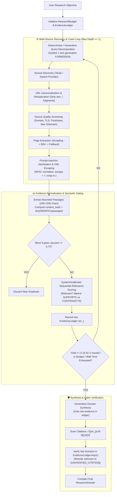

# ADR_R1_DEEP_RESEARCH.md — Architecture Decision Record: Deep Research Engine

- **Date**: 2026-09-24
- **Status**: ACCEPTED (Post Adversarial Plan Review)
- **Reviewer**: Subagent `e22ca329-86dd-4263-a208-d69ae9cb8471` (Approved with 5 Blocking Requirements Incorporated)
- **Target Engine**: Phase R1 — Deep Research Engine

---

## 1. Context & Problem Statement
Currently, LAYA's research capability is monolithic and naive:
`AutonomousPlanner` intercepts keywords `"dossier"` or `"report"`, invokes `web_search(prompt)` (fetching top 6 Tavily links), executes a single fullscreen Playwright browse pass, and asks cloud LLMs to synthesize a summary.

Deficiencies of the legacy approach:
1. **Shallow Breadth**: Does not perform multi-query decomposition or follow-up query expansion.
2. **No Evidence Ledger**: Information is not retained as structured, hashed evidence with passage-level attribution.
3. **No Saturation Control**: Cannot dynamically decide when sufficient evidence has been gathered.
4. **No Claim Verification**: Statements in the summary are not verified against physical evidence hashes; hallucinations can pass undetected.
5. **No Prompt-Injection Screening**: Untrusted web text is concatenated directly into LLM prompts without isolation or sanitization.

---

## 2. External Technology Audit & Evaluations

| Project / Technology | Version / Commit | License | Footprint / Platform | Decision | Rationale |
| :--- | :--- | :--- | :--- | :--- | :--- |
| **Tavily AI (Search / Extract / Crawl)** | Installed SDK | Commercial API | Remote API, 0 local RAM | **ADAPT** | High precision web search and extraction. Wrap behind a mockable `SearchProvider` protocol with offline fixture fallback when `TAVILY_API_KEY` is missing. |
| **Scrapling** | 0.4.9 | BSD-3-Clause | Pure Python / C, <50MB RAM, Windows OK | **ADOPT** | Fast, stealthy HTTP page fetching and CSS/XPath selection without launching full browser instances. Ideal for secondary page crawling. |
| **Crawl4AI** | 0.4.x | Apache 2.0 | Heavy (requires Playwright daemons + torch vision, >1.5GB RAM) | **REJECT** | Prohibitive local RAM footprint on 8GB host machine. Redundant with Scrapling + native Playwright. |
| **LlamaIndex + Jev Retrieval** | Reference pattern | MIT | Framework overhead | **REFERENCE ONLY** | Pattern of bounded semantic relevance scoring is adopted natively in `omni_engine/research/` without installing heavy LlamaIndex dependencies. |
| **Jev Search** | TypeSafe API | Commercial | Remote | **REFERENCE ONLY** | Contingent on `TYPESAFE_API_KEY` and user provider allowlist policy. |
| **Citation-Verifier Pattern** | Native architecture | MIT / Internal | Minimal | **ADAPT** | Formal evidence ledger linking claims to hashed text passages, verifying attribution before completing research dossiers. |
| **Legacy `web_tools.py`** | Local codebase | Internal | 0 overhead | **ADAPT / RETAIN** | Retain primitive functions for backward compatibility; wire deep research engine through `CapabilitySpec`. |

---

## 3. Target Research Architecture & Pipeline

---

## 4. Invariants & Blocking Requirements Incorporated

1. **System 1 Prime Invariant Enforcement (REQ-B1)**:
   - System 1 (LAYA) is strictly forbidden from generating novel query prose.
   - Sub-query decomposition is performed deterministically (keyword/facet heuristics) or escalated to `GenerativeProvider`.
   - System 1 is restricted strictly to scoring passage relevance (0.0 to 1.0) and stance classification (`SUPPORTS`, `CONTRADICTS`, `NEUTRAL`).
2. **Deterministic Evidence & Cryptographic Citation Verification (REQ-B2)**:
   - Evidence identity: `content_hash = sha256(NFKC(passage_text)).hexdigest()`, `evidence_id = f"ev_{content_hash[:10]}"`.
   - Every citation in summary `[ev_...]` is checked against `EvidenceLedger.keys()`. Unknown IDs are rewritten to `[UNVERIFIED_CITATION: <id>]` and tracked in telemetry. Zero hallucinated claims receive `VERIFIED` status.
3. **Mathematical Saturation & Crawl Bounding (REQ-B3)**:
   - Hard bounds: `max_crawl_depth <= 1` (root search + direct children only; no unbounded spidering), `max_pages_per_domain <= 3`, `max_total_pages <= 10`, `max_search_queries <= 5`, `max_wall_time_sec <= 60.0s`.
   - Word 3-gram Jaccard duplicate pruning ($J \ge 0.70$).
   - Formal saturation: Stop when novel yield $Y_k \le 0.15$ for 2 consecutive iterations.
4. **Prompt-Injection Sanitization & XML Escaping (REQ-B4)**:
   - `sanitize_untrusted_web_content()`:
     - NFKC normalization to neutralize homoglyphs.
     - Stripping of zero-width characters and control codes.
     - Escaping literal `<` and `>` to `&lt;` and `&gt;` preventing synthetic closing tags.
     - Enclosing in `<untrusted_external_data origin="{url}" hash="{hash}">\n{text}\n</untrusted_external_data>`.
     - Untrusted data is never placed in LLM `system` prompts.
5. **PolicyEngine & ArgumentResolver Registration (REQ-B5)**:
   - `deep_research` and `research.deep` registered in `PolicyEngine.assess_action` with `blast_radius = "EXTERNAL_NETWORK"`.
   - `deep_research` registered in `ArgumentResolver` with parameter extraction and clarification prompts.
6. **100% Offline Testability**:
   - `DeepResearchEngine` accepts injectable `SearchProvider`, `PageFetcher`, and `GenerativeSynthesizer` protocols. All unit tests run offline in $<2.0$ seconds without live network dependencies.
